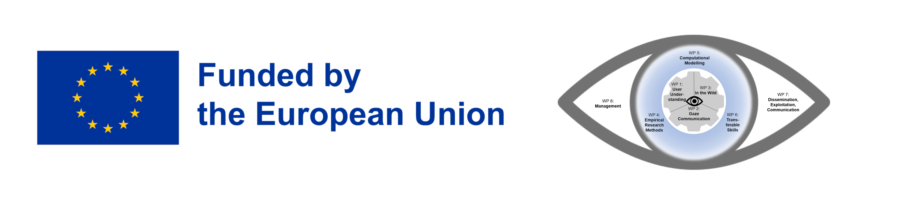

# eye-tracking-min-aoi-calculator

A Python tool for calculating minimum Area of Interest (AOI) sizes in eye-tracking studies based on eye tracker accuracy and screen parameters. This tool helps researchers determine appropriate AOI dimensions that account for eye tracker error margins.

## Project Description
Eye-tracking researchers often need to define Areas of Interest (AOIs) in their experiments. The size of these AOIs needs to account for the accuracy limitations of the eye tracker being used. This tool converts between visual angles, pixels, and physical measurements to calculate the minimum AOI size needed based on:
- Eye tracker's accuracy (in degrees of visual angle)
- Screen dimensions (both in pixels and physical measurements)
- Participant's viewing distance

## Installation
```bash
git clone https://github.com/yourusername/eye-tracking-min-aoi-calculator.git
cd eye-tracking-min-aoi-calculator
```

## Usage
### Basic Usage
```python
from aoi_calculator import calculate_aoi_size

# Calculate minimum AOI size for 1-degree error
results = calculate_aoi_size(
    error_degrees=1.0,
    screen_width_px=1920,
    screen_height_px=1080,
    screen_width_mm=530,
    screen_height_mm=300,
    distance_mm=750
)

print(f"Minimum AOI width: {results['recommended_aoi_size']['width_pixels']:.1f} pixels")
print(f"Minimum AOI height: {results['recommended_aoi_size']['height_pixels']:.1f} pixels")
```

### Multiple Error Degrees
```python
# Calculate for different error values
error_degrees_list = [0.5, 1.0, 1.5]
for error_deg in error_degrees_list:
    results = calculate_aoi_size(error_deg)
    print(f"\nResults for {error_deg}° error:")
    print(f"Minimum AOI size: {results['recommended_aoi_size']['width_pixels']:.1f} x "
          f"{results['recommended_aoi_size']['height_pixels']:.1f} pixels")
```


## Input Parameters
- `error_degrees`: Eye tracker's accuracy in degrees of visual angle
- `screen_width_px`: Screen width in pixels
- `screen_height_px`: Screen height in pixels
- `screen_width_mm`: Physical screen width in millimeters
- `screen_height_mm`: Physical screen height in millimeters
- `distance_mm`: Viewing distance in millimeters

## Output Format
Returns a dictionary containing:
- Error margins in pixels (horizontal and vertical)
- Recommended minimum AOI dimensions in:
  - Pixels
  - Visual angles (degrees)

## Dependencies
- Python 3.6+
- math (standard library)

## License
MIT License

## Acknowledgments

This project has received funding from the European Union's Horizon Europe research and innovation funding program under grant agreement No 101072410, Eyes4ICU project.

<p align="center">

</p>